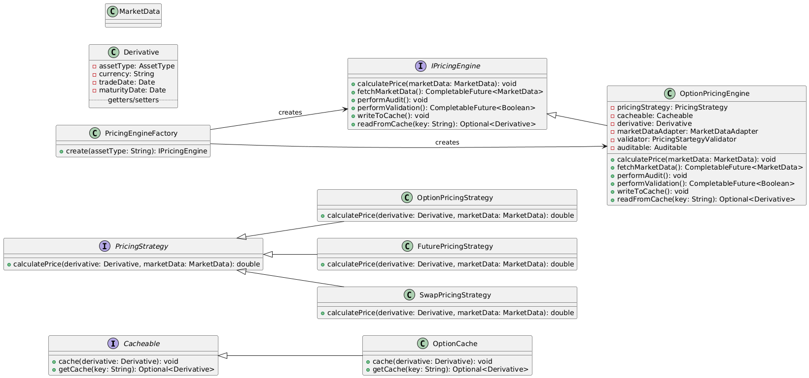

<h2>Dynamic Pricing Engine for Finance</h2>
<h3>Scenario:</h3>

Design a pricing engine for derivatives that supports different asset classes (options, swaps, futures). Pricing algorithms vary greatly and depend on external data feeds. Each algorithm has its own validation, audit trail, and caching strategy.

<h3>Question:</h3>
<ul>
<li>How do you define pricing behavior without hardcoding it?</li>
<li>How do you plug in different audit or caching strategies without tight coupling?</li>
<li>How do you support composable pricing logic?</li>
<li>What interfaces would you create?</li>
</ul>
<h3>Answer:</h3>
<table>
    <tr>
        <th>SN</th>
        <th>Question Demand</th>
        <th>Answer</th>
    </tr>
        <td>1</td>
        <td>Defining pricing behavior</td>
        <td>By using <strong>PricingStartigy</strong> interface. </td>
    <tr>
    </tr>
        <td>2</td>
        <td>Plugging in different audit or caching strategies</td>
        <td>Using <strong>Factory pattern</strong> to create different <strong>PricingEngine</strong> with own <strong>caching and audit strategy.</strong> </td>
    <tr>
    </tr>
        <td>3</td>
        <td>Supporting composable pricing logic</td>
        <td> Using <strong>decorator</strong> to compose different pricing logic.</td>
    <tr>
    </tr>
        <td>4</td>
        <td>Interfaces</td>
        <td>Cacheable, PricingStrategy, Auditable, MarketDataAdapter, PricingStrategyValidator, IPricingEngine.</td>
    <tr>

</table>
<h3>Class Diagram:</h3>
