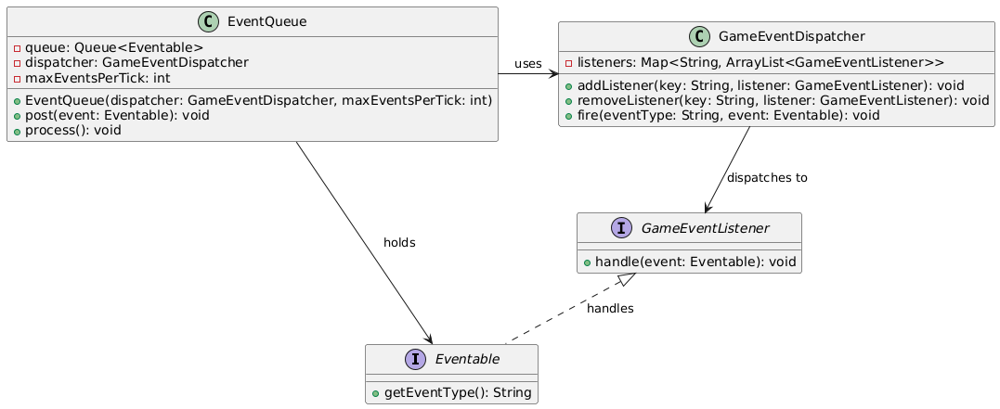

<h2>Multiplayer Game Event System</h2>

<h3>Scenario:</h3>

Design a system to manage game events (player hit, item collected, 
enemy spawned). Events may trigger other events. Developers should be 
able to add custom event listeners for analytics, balancing, or 
player behavior tracking.

<h3>Question:</h3>
<ul>
    <li>What classes/interfaces would you create for events and event listeners?</li>
    <li>How do you prevent event explosions in code?</li>
    <li>How can new events or subscribers be added without modifying core systems?</li>
</ul>

<h3>Answer:</h3>
<table>
    <tr>
        <th>SN</th>
        <th>Question Demand</th>
        <th>Answer</th>
    </tr>
        <td>1</td>
        <td>Classes/interfaces to be created</td>
        <td><strong>Eventable, GameEventDispatcher, GameEventListener</strong></td>
    <tr>
    </tr>
        <td>2</td>
        <td>Preventing event explosions</td>
        <td>Using an <strong>EventQueue</strong> to handle event execution.</td>
    <tr>
    </tr>
        <td>3</td>
        <td>Adding new events or subscribers </td>
        <td> Using <strong>Eventable</strong> interface for <strong>new Event</strong> and 
        <strong>GameEventListener</strong> interface for <strong>new EventListener.</strong></td>
    <tr>

</table>
<h3>Class Diagram:</h3>
