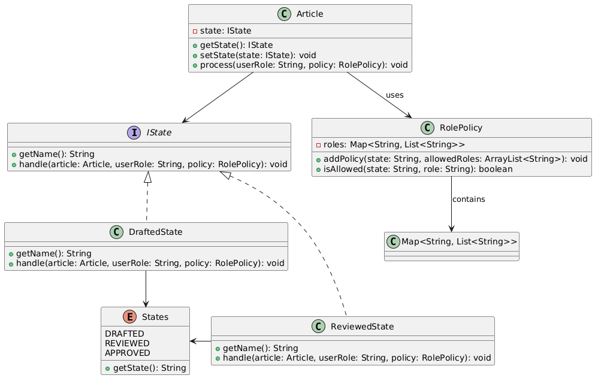

<h2>Digital Publishing Workflow</h2>

<h3>Scenario:</h3>

A large publishing house is building a digital workflow for 
content creation, editing, and distribution. Articles go through 
different stages: drafted, reviewed, approved, translated, and 
published. Each stage may involve different roles (e.g., editor, 
legal reviewer, translator), and some articles may bypass certain 
steps based on their category.

<h3>Question:</h3>
<ul>
    <li>How would you model the state transitions and roles in the publishing pipeline?</li>
    <li>What design choices support adding a new step like fact-checking without modifying existing logic?</li>
    <li>How do you enforce responsibility separation between state management and action execution?</li>
</ul>

<h3>Answer:</h3>
<table>
    <tr>
        <th>SN</th>
        <th>Question</th>
        <th>Answer</th>
    </tr>
        <td>1</td>
        <td>How would you model the state transitions and roles in 
        the publishing pipeline?</td>
        <td>Having a <strong>class</strong> for each state and managing <strong>roles</strong> for each <strong>state</strong> class in a separate file.</td>
    <tr>
    </tr>
        <td>2</td>
        <td>What design choices support adding a new step like fact-checking without modifying existing logic?</td>
        <td>Using a <strong>state</strong> interface.</td>
    <tr>
    </tr>
        <td>3</td>
        <td>How do you enforce responsibility separation between state management and action execution?</td>
        <td><strong>Action</strong> is handled by <strong>each state class</strong> and state is managed by <strong>Article</strong> class itself.</td>
    <tr>

</table>
<h3>Class Diagram:</h3>
