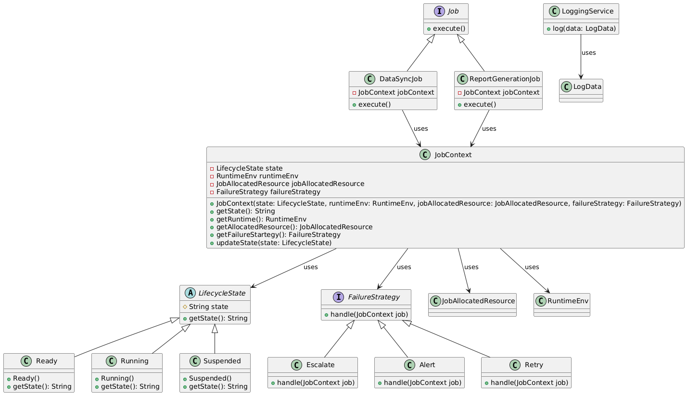

<h2>Distributed Job Scheduler</h2>

<h3>Scenario:</h3>

You are building a distributed job scheduler that runs various 
types of jobs (data sync, report generation, ML retraining). Each 
job has specific runtime requirements, failure strategies (retry, 
alert, escalate), and resource needs. The scheduler must support 
plug-in job types and logging/auditing.

<h3>Question:</h3>
<ul>
    <li>How do you abstract job types and lifecycle stages (ready, running, failed)?</li>
    <li>How do you ensure that each job’s error handling and logging is handled in a SOLID-compliant way?</li>
    <li>How would you enable new job types with minimal impact on the scheduler core?</li>
</ul>

<h3>Answer:</h3>
<table>
    <tr>
        <th>SN</th>
        <th>Question</th>
        <th>Answer</th>
    </tr>
        <td>1</td>
        <td>How do you abstract job types and lifecycle stages (ready, running, failed)?</td>
        <td>Having an interface for <strong>Job Types</strong> and an <strong>Interface</strong> for lifecycle.</td>
    <tr>
    </tr>
        <td>2</td>
        <td>How do you ensure that each job’s error handling and logging is handled in a SOLID-compliant way?</td>
        <td>By using <strong>Logging Service</strong> and <strong>Error Handler Service</strong> with <strong>failure strategy</strong>.</td>
    <tr>
    </tr>
        <td>3</td>
        <td>How would you enable new job types with minimal impact on the scheduler core?</td>
        <td>By implementing <strong>JobType</strong> interface.</td>
    <tr>

</table>
<h3>Class Diagram:</h3>
